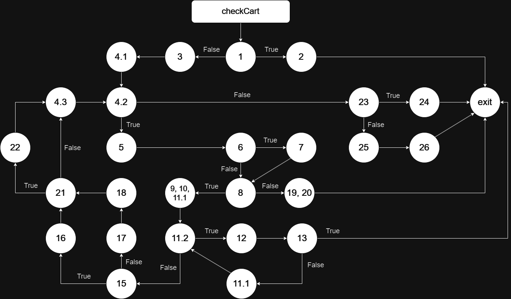

# Втора лабораториска вежба по Софтверско инженерство

## Андреј Стојковиќ, бр. на индекс 225043

##  Control Flow Graph

## Цикломатска комплексност

Цикломатската комплексност на овој код е <b>10</b> 

Формула: P + 1, каде што P е бројот на предикатни јазли.  
<code><b>P + 1 = 9 + 1 = 10<b></code>

## Every Branch критериум

1. <code>allItems == null</code>, во овој тест се праќа null листа како параметар и програмата фрла runtime exception и прекинува.
2. <code>item.getBarcode() != null</code>, се праќа листа со повеќе елементи, фрла runtime exception доколку има баркодот кој е null.
3. <code>allowed.indexOf(c) == -1</code>, се праќа листа со повеќе елементи и фрла runtime exception доколку баркодот е невалиден.
4. <code>sum <= payment</code>, прави проверка дали сумата на сите производи е помала или еднаква од 'payment'. Враќа true доколку вредноста е поголема.
5. <code>sum > payment</code>, прави проверка дали сумата на сите производи е поголем од 'payment' и враќа true доколку вредноста е помала или еднаква од 'payment'.

## Multiple Condition критериум

Проверка на условите: item.getPrice() > 300 && item.getDiscount() > 0 && item.getBarcode().charAt(0) == '0'

- TTT - assertTrue доколку сите услови се исполнети
- TTF - assertTrue доколку цената на сите производи е поголема од 300, има попуст поголем од нула и баркодот не почнува со карактерот '0'
- TFX - assertTrue доколку цената на сите производи е поголема од 300 и нема попуст поголем од нула
- FXX - assertTrue доколку цената на сите производи не е поголема од 300

